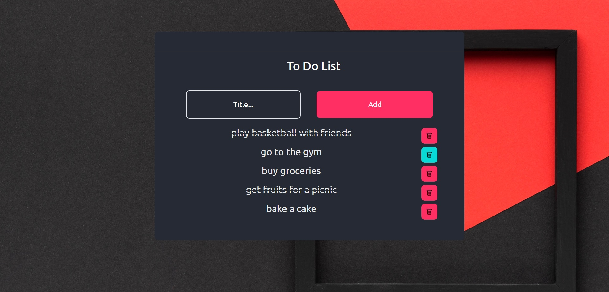
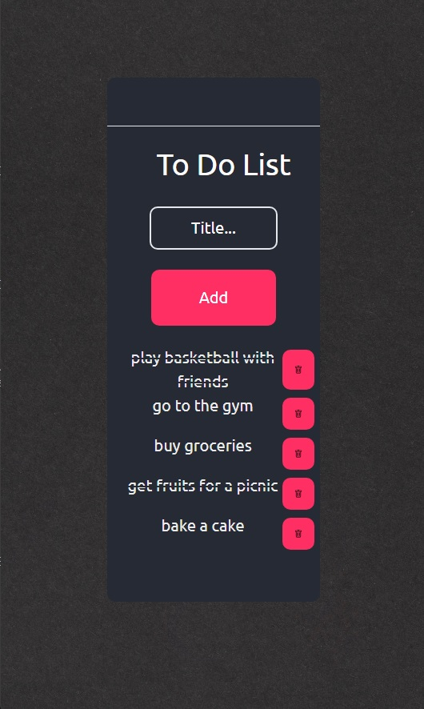

# To-do-list app 
To run the app, first go to the client folder and in the
cmd use "npm run build", make sure you have mongoDB installed
for CRUD in the server.js to work.
## Table of contents

- [Overview](#overview)
  - [The challenge](#the-challenge)
  - [Screenshot](#screenshot)
  - [Links](#links)
- [My process](#my-process)
  - [Built with](#built-with)
  - [What I learned](#what-i-learned)
  - [Continued development](#continued-development)
  - [Useful resources](#useful-resources)
- [Author](#author)
- [Acknowledgments](#acknowledgments)

## Overview

### The challenge

Users should be able to:

- View the optimal layout depending on their device's screen size
- See hover states for interactive elements

- Add a task into a collection
- Delete a task
- And app is connected to a local MongoDB

### Screenshot





### Links

- Repository URL: [Add solution URL here](hhttps://github.com/coder-96/to-do-list)

## My process

### Built with
Frontend:
- Semantic HTML5 markup & Non-Semantic HTML5
- CSS custom properties
- Flexbox
- Desktop, Mobile design

- [React](https://reactjs.org/) - JS library
- [Tailwind CSS](https://tailwindcss.com/) - Tailwind CSS framework

Backend:
- Node.js
- Express.js - a minimal and flexible Node.js web application framework

DB:
- MongoDB
- Mongoose - an ODM (Object Data Modeling) library for MongoDB

### What I learned

Improved my React, Tailwind CSS, Express.js, Mongoose skills.

```css
p {
    @apply text-tr-white;
  }
```
```react jsx
<>
    useEffect(() => {
        axios
            .get("http://localhost:5000/getnotes")
            .then((res) => {
                console.log("Received data");

                let notes = res.data;
                for (let i = 0; i < notes.length; i++) {
                    setItems((prevValue) => {
                        return [...prevValue, notes[i].content];
                    });
                }
            })
            .catch((err) => {
                console.log(err);
            });
    }, []);
</>
```

### Continued development

I'm focused on perfecting my Frontend and Backend skills by building more full stack projects.

### Useful resources

- [MDN Web Docs](https://developer.mozilla.org/en-US/) - helped me find answers when I got stuck.

- [Tailwind CSS Docs](https://tailwindcss.com/docs/installation) - helped me get along with Tailwind CSS.

## Author

- Website - [Jalga](https://github.com/coder-96)

## Acknowledgments

I thank my family for supporting me on my way to becoming a Full Stack Developer. 